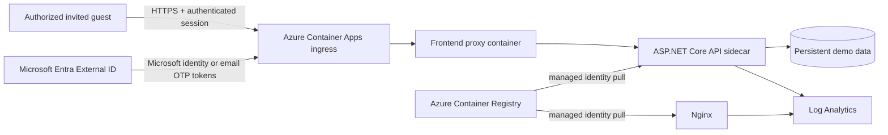

# Proposed Azure demo architecture

Status: **static design only; never deployed**  
Region: Australia East

## Trust boundaries

1. Internet to managed HTTPS ingress: every visitor is untrusted until Entra B2B authentication succeeds and the application's invitation and assignment policy permits the guest.
2. Ingress to frontend proxy: the proxy is the only publicly routed container.
3. Frontend proxy to API: the API has no separate public ingress.
4. API to persistent storage: application data crosses into a separately managed persistence boundary.
5. Container Apps to ACR: a user-assigned identity has only `AcrPull` on the registry.
6. Runtime to logs: application and platform output can leave the replica for Log Analytics and must not contain secrets or sensitive real-user data.

## Runtime invariants

- Runtime scaling must remain compatible with the selected persistence design.
- Every non-health application route must require Entra authentication and server-side authorization for an assigned invited guest; direct API requests must not bypass access control.
- The public demo uses `AI__Provider=Mock`; no paid-provider secret is supplied.
- Images must be referenced by a commit-specific tag or digest.
- Only safe fictional demo content may be stored.
- Demo storage is bounded through configuration; seed and reset behavior remains future work.
- Deployment is blocked until `docs/auth-todo.md` is complete and the remaining review in `docs/security-review.md` is approved.
