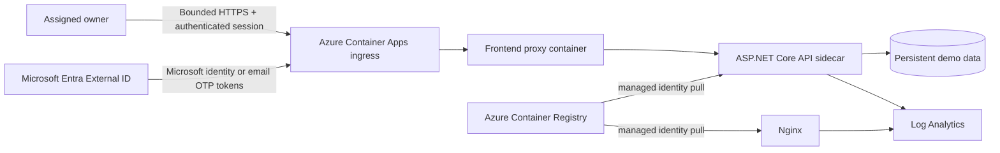

# Azure deployment architecture

Status: **private owner-only infrastructure and the Azure SQL-backed Container
App are deployed; external ingress is disabled outside bounded verification**
Region: Australia East

The temporary private milestone uses an externally reachable Azure URL with Microsoft Entra application access assigned only to the owner. It does not use private-network-only ingress. Public production remains a later milestone.

```mermaid
flowchart LR
    Owner[Assigned owner] -->|Bounded HTTPS + authenticated session| Ingress[Azure Container Apps ingress]
    Entra[Microsoft Entra External ID] -->|Microsoft identity or email OTP tokens| Ingress
    Ingress --> Proxy[Frontend proxy container]
    Proxy --> Api[ASP.NET Core API sidecar]
    Api --> Store[(Persistent demo data)]
    ACR[Azure Container Registry] -->|managed identity pull| Nginx
    ACR -->|managed identity pull| Api
    Api --> Logs[Log Analytics]
    Nginx --> Logs
```

## Trust boundaries

1. Internet to managed HTTPS ingress: every visitor is untrusted until Entra B2B authentication succeeds and the application's invitation and assignment policy permits the guest.
2. Ingress to frontend proxy: the proxy is the only publicly routed container.
3. Frontend proxy to API: the API has no separate public ingress.
4. API to persistent storage: application data crosses into a separately managed persistence boundary.
5. Container Apps to ACR: a user-assigned identity has only `AcrPull` on the registry.
6. Runtime to logs: application and platform output can leave the replica for Log Analytics and must not contain secrets or sensitive real-user data.

## Runtime invariants

- The private deployment uses Azure SQL Database serverless with `Database__Provider=SqlServer` and startup migrations disabled. The SQL Server migration runs before the serving revision starts; see [the database checklist](db-todo.md).
- Frontend and backend containers each use internal HTTP Startup, Readiness, and Liveness probes. Both containers must become ready before the revision receives ingress traffic.
- Frontend probes test nginx directly at `/`; backend probes test the API directly at `/health`. The public nginx `/health` route remains an end-to-end backend diagnostic and is not used for frontend container health.
- Every non-health application route must require Entra authentication and server-side authorization for an assigned invited guest; direct API requests must not bypass access control.
- The private deployment uses `AI__Provider=Mock`; no paid-provider secret is supplied.
- Images must be referenced by a commit-specific tag or digest.
- Only safe fictional demo content may be stored.
- Demo storage is bounded through configuration; seed and reset behavior remains future work.
- SQLite on Azure Files was rejected after its clean-database migration-start failure. Local development and Docker Compose retain SQLite only as their local persistence option.
- External ingress is disabled outside bounded owner verification. One active
  revision is valid in Single revision mode while ingress is disabled.
- Public production will reassess networking, availability, and migration
  requirements rather than inheriting private-demo trade-offs.
